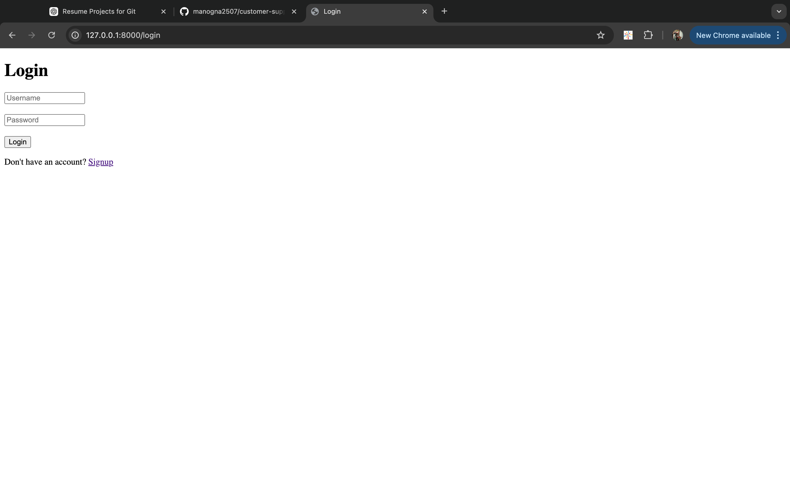
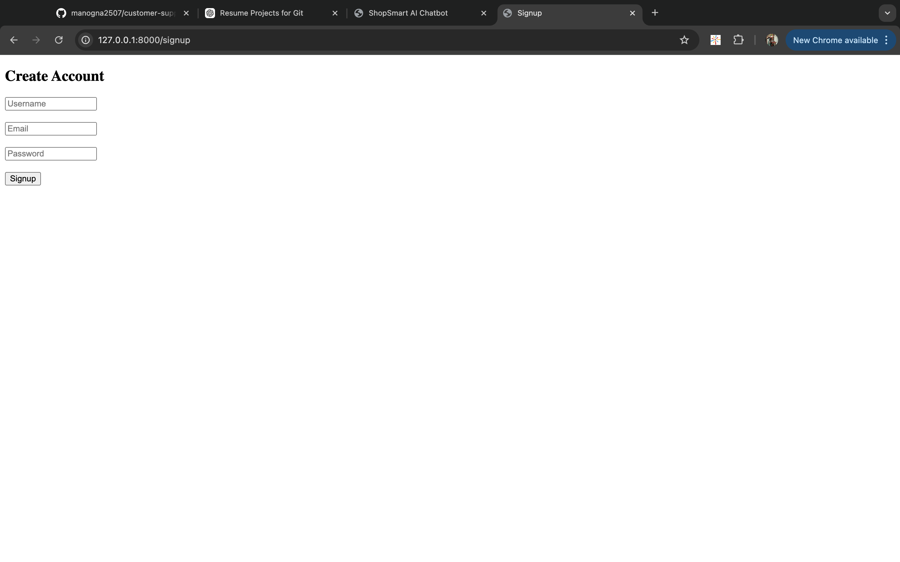
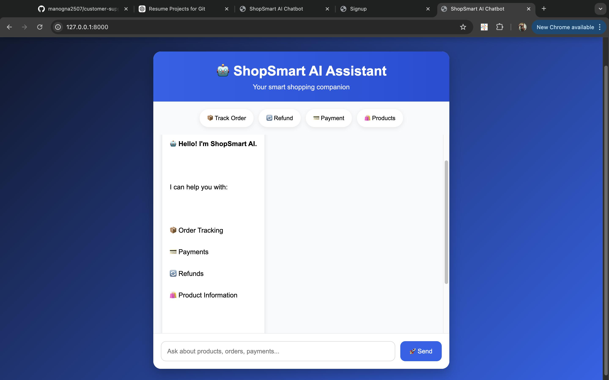
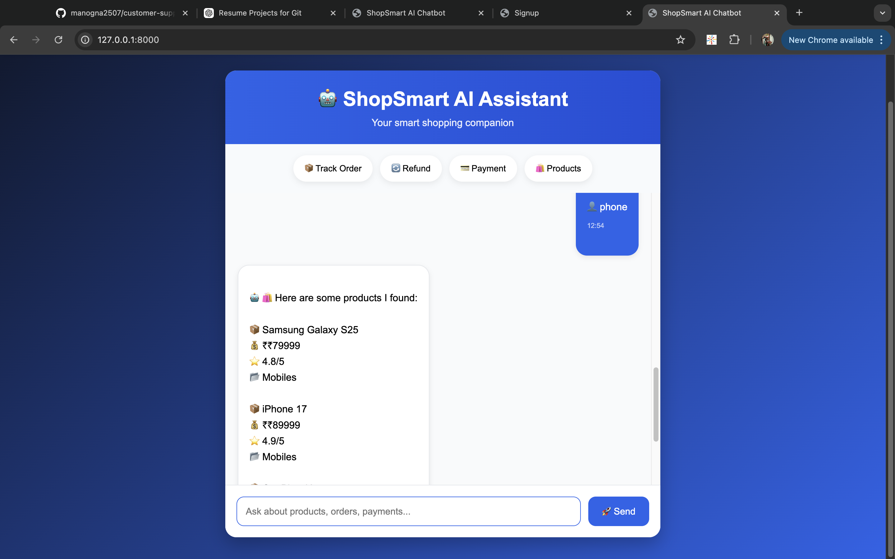
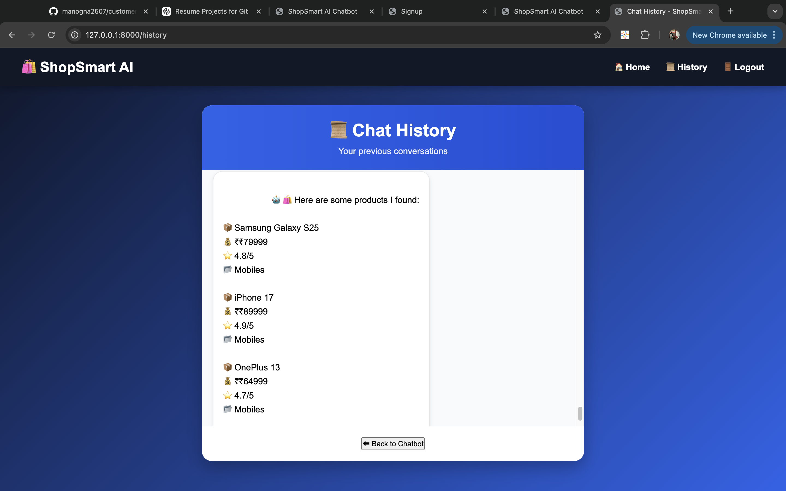

# 🛍️ ShopSmart AI Customer Support Chatbot

An AI-powered e-commerce customer support chatbot built with **Python, Flask, TensorFlow, NLTK, and SQLite**.

ShopSmart combines **machine-learning-based intent classification** with deterministic product search and order tracking to provide users with an interactive customer-support experience.

---

## 🚀 Features

### 🤖 AI-Powered Support

- TensorFlow-based intent classification
- NLTK tokenization and lemmatization
- Bag-of-Words text representation
- Confidence-based intent prediction
- 7 customer-support intents
- 1,435 training patterns

### 🛍️ Product Search

- Search products using natural-language queries
- Search by product name and category
- Displays:
  - Product name
  - Price
  - Rating
  - Category

### 📦 Order Tracking

- Track orders using Order IDs such as `ORD1002`
- Displays:
  - Order ID
  - Product
  - Order status
  - Expected delivery date
- Handles invalid Order IDs

### 🔐 User Authentication

- User signup and login
- Password hashing using Werkzeug
- Flask session-based authentication
- Duplicate username/email handling
- Logout functionality

### 💬 Chat History

- Stores conversations in SQLite
- Associates conversations with logged-in users
- Displays previous user messages and chatbot responses
- Includes timestamps

### 🌐 Web Application

- Flask backend
- Interactive chatbot interface
- Quick-action buttons
- Responsive UI
- REST-style `/chat` endpoint

---

## 🧠 AI / Machine Learning

The chatbot uses a supervised neural-network classifier to identify the user's intent.

### Text Processing Pipeline

```text
User Message
     ↓
NLTK Tokenization
     ↓
Lemmatization
     ↓
Bag-of-Words Representation
     ↓
Neural Network
     ↓
Intent Prediction
     ↓
Response Selection
Model Architecture
Input Layer
    ↓
Dense Layer (128 neurons, ReLU)
    ↓
Dropout (0.5)
    ↓
Dense Layer (64 neurons, ReLU)
    ↓
Dropout (0.5)
    ↓
Output Layer (7 intents, Softmax)

The model uses:

Adam optimizer
Learning rate: 0.001
Categorical cross-entropy loss
100 training epochs
Batch size: 16
80/20 stratified train/test split
🎯 Supported Intents

The final classifier contains 7 customer-support intents:

order_status
refund
cancel_order
delivery
payment
account
contact_support

The training data was prepared by combining the project's original support patterns with selected examples from a customer-support dataset.

📊 Model Evaluation

The model was evaluated using an unseen 20% held-out test split.

Metric	Score
Test Accuracy	99.65%
Macro Precision	0.9966
Macro Recall	0.9965
Macro F1-score	0.9965
Dataset
Total patterns: 1,435
Number of intents: 7
Training samples: 1,148
Test samples: 287
Vocabulary size: 448

Note: These metrics represent performance on a held-out split from the prepared dataset. They should not be interpreted as production or real-world customer-support accuracy.

🔀 Response Routing

ShopSmart uses a hybrid approach instead of relying entirely on the ML model.

User Message
     │
     ├── Generic conversation?
     │       └── Deterministic response
     │
     ├── Contains Order ID?
     │       └── Search orders.json
     │
     ├── Product-related query?
     │       └── Search SQLite products
     │
     ├── Support intent?
     │       └── TensorFlow classifier
     │
     └── Otherwise
             └── Fallback response

This allows structured tasks such as order tracking and product lookup to be handled deterministically while using the ML model for natural-language support requests.

🛠️ Tech Stack
Technology	Purpose
Python	Core programming language
Flask	Web application and REST endpoints
TensorFlow / Keras	Intent classification
NLTK	NLP preprocessing
SQLite	User, product and chat-history storage
HTML	Web interface
CSS	UI styling
JavaScript	Chat interaction
Werkzeug	Password hashing
Pytest	Automated testing
📂 Project Structure
customer-support-chatbot/
│
├── app.py
├── chatbot.py
├── db.py
├── prepare_dataset.py
├── train.py
├── requirements.txt
├── .gitignore
│
├── data/
│   ├── intents.json
│   ├── support_intents.json
│   └── orders.json
│
├── models/
│   ├── chatbot_model.keras
│   ├── words.pkl
│   └── classes.pkl
│
├── templates/
│   ├── index.html
│   ├── login.html
│   ├── signup.html
│   └── history.html
│
├── static/
│   └── style.css
│
├── screenshots/
│   ├── login.png
│   ├── signup.png
│   ├── chatbot.png
│   ├── search.png
│   └── history.png
│
└── tests/
    └── test_chatbot.py

Local runtime files such as the SQLite database, virtual environment, raw external dataset and trained .keras model are excluded from Git using .gitignore where appropriate.

⚙️ Installation
1. Clone the repository
git clone https://github.com/manogna2507/customer-support-chatbot.git
cd customer-support-chatbot
2. Create a virtual environment
python -m venv .venv
3. Activate the virtual environment
macOS / Linux
source .venv/bin/activate
Windows
.venv\Scripts\activate
4. Install dependencies
pip install -r requirements.txt
5. Run the application
python app.py
6. Open the application
http://127.0.0.1:8000
🧪 Running Tests

Run the automated tests using:

PYTHONPATH=. pytest -v

The test suite covers functionality including:

Generic responses
Product search
Order lookup
Invalid Order IDs
Order ID extraction
Refund intent prediction
🏋️ Retraining the Model

The training data preparation pipeline can be regenerated with:

python prepare_dataset.py

Then retrain the classifier with:

python train.py

The trained model and supporting vocabulary/class files are generated under:

models/

## 📸 Screenshots

### Login Page


### Signup Page


### Chatbot Home


### Product Search


### Chat History


## 👩‍💻 Developed By

**Manogna Gampala**
